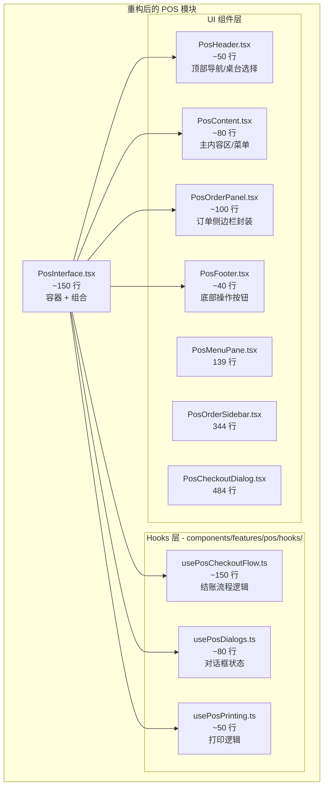

# PosInterface 组件拆分详细计划

- ID: pos-02-component-split
- Owner: 待分配
- Status: pending
- Parent: [phase2_implementation_PLAN.md](file:///Users/zhuyuxia/Documents/GitHub/easyFactu/doc/agents/features/phase2_implementation_PLAN.md) Task 2

根据 [phase2_implementation_PLAN.md](file:///Users/zhuyuxia/Documents/GitHub/easyFactu/doc/agents/features/phase2_implementation_PLAN.md) 中 Task 2 (POS-02) 的要求，需要将 `PosInterface.tsx` 从当前的 **593 行**拆分至 **< 300 行**。

## 当前状态分析

### 现有文件结构

| 文件 | 行数 | 职责 |
|------|------|------|
| [PosInterface.tsx](file:///Users/zhuyuxia/Documents/GitHub/easyFactu/components/features/pos/PosInterface.tsx) | 593 | 主容器：状态管理、业务逻辑、事件处理 |
| [PosMenuPane.tsx](file:///Users/zhuyuxia/Documents/GitHub/easyFactu/components/features/pos/PosMenuPane.tsx) | 139 | 菜单选择面板 ✅ |
| [PosOrderSidebar.tsx](file:///Users/zhuyuxia/Documents/GitHub/easyFactu/components/features/pos/PosOrderSidebar.tsx) | 344 | 订单侧边栏 ✅ |
| [PosCheckoutDialog.tsx](file:///Users/zhuyuxia/Documents/GitHub/easyFactu/components/features/pos/PosCheckoutDialog.tsx) | 484 | 结账对话框 ✅ |
| [PosReceiptPreview.tsx](file:///Users/zhuyuxia/Documents/GitHub/easyFactu/components/features/pos/PosReceiptPreview.tsx) | ~120 | 小票预览 ✅ |

### 问题识别

`PosInterface.tsx` 当前承担过多职责：

1. **状态管理** (L21-86): 17 个 useState/hooks 调用
2. **业务逻辑函数** (L122-435): 共 ~313 行事件处理代码
   - `handleCheckout` (L157-316): 160 行 - **最大瓶颈**
   - `handleAA` (L326-347): 22 行
   - `handleOpenCheckout` (L349-370): 22 行
   - `handleOpenSplitDialog` (L397-423): 27 行
   - `handleOpenMergeDialog` (L425-435): 11 行
   - 其他辅助函数: ~70 行
3. **渲染逻辑** (L437-591): 155 行

---

## 拆分策略

### 核心原则

1. **状态提升与封装**: 将复杂状态逻辑抽取为自定义 hooks
2. **关注点分离**: 每个子组件只处理单一职责
3. **依赖注入**: 通过 props 和 context 传递依赖
4. **渐进式重构**: 保持向后兼容，逐步迁移
5. **按父计划交付**: 同时创建 Hooks 和 UI 子组件
6. **布局保持不变**: 两栏结构与视觉层级保持一致，UI 仅做结构拆分

> [!IMPORTANT]
> **Hooks 存放位置说明**：本计划中新建的 hooks 将放置在 `components/features/pos/hooks/` 目录下，作为 POS 模块的内部 hooks。根目录的 `hooks/` 为兼容层，仅存放跨模块复用的全局 hooks。

### 目标架构



> [!NOTE]
> **布局说明**：`PosHeader` 通过 `variant` 放在左右两列顶部，保持“返回按钮在左列顶部、桌台选择在右列顶部”的原始位置与视觉层级不变；其中 `variant="order"` 必须渲染在 `PosOrderPanel` 的卡片头部内。

---

## 详细任务清单

### Task 1: 创建 `usePosCheckoutFlow` Hook

**目的**: 抽取结账核心逻辑 (`handleCheckout`、`handleAA`、`handleOpenCheckout`)

**预计时间**: 1 小时

#### [NEW] [usePosCheckoutFlow.ts](file:///Users/zhuyuxia/Documents/GitHub/easyFactu/components/features/pos/hooks/usePosCheckoutFlow.ts)

**AI 提示词**:
```
ultrathink

你是一位资深的 React Hooks 工程师。请完成以下任务：

## 背景
当前 `components/features/pos/PosInterface.tsx` 中的结账相关逻辑过于复杂（~180 行），需要抽取为独立的 hook。

## 任务
1. 创建 `components/features/pos/hooks/usePosCheckoutFlow.ts`，抽取以下内容：
   - `handleCheckout` 函数（L157-316）
   - `handleAA` 函数（L326-347）
   - `handleOpenCheckout` 函数（L349-370）
   - `printData` 和 `isPrinting` 状态（L44-45）

2. 接口设计：
   ```typescript
   interface UsePosCheckoutFlowParams {
     selectedTable: string
     cart: CartItem[]
     batches: OrderBatchView[]
     currentOrder: Order | null
     tables: RestaurantTableView[]
     tableNumberParam: string
     checkoutState: CheckoutState
     checkoutActions: CheckoutActions
     aggregatedItems: Array<{ id: string; name: string; quantity: number; price: number }>
     clearCart: () => void
     reloadTables: () => Promise<void>
     applyOrderState: (state: OrderState) => void
     setOrderError: (error: string | null) => void
   }

   interface UsePosCheckoutFlowReturn {
     // 结账操作
     handleCheckout: () => Promise<void>
     handleAA: () => void
     handleOpenCheckout: () => void
     
     // 结账状态 - 必须传递给 PosCheckoutDialog
     isCheckoutLoading: boolean  // checkoutMutation.isPending
     
     // 打印状态
     printData: CheckoutReceiptData | null
     isPrinting: boolean
     setPrintData: (data: CheckoutReceiptData | null) => void
     setIsPrinting: (value: boolean) => void
   }
   ```

3. 使用 `useCheckout` mutation（来自 `@/lib/queries`）
4. 使用 `useToast` 进行错误提示
5. **重要**：确保 `isCheckoutLoading` 暴露出来，供 `PosCheckoutDialog` 的 `checkoutLoading` prop 使用

## 技术要求
- TypeScript 类型安全
- 保持现有功能不变
- 不修改 UI 布局

## 涉及文件
- `components/features/pos/hooks/usePosCheckoutFlow.ts`（新建）
- `components/features/pos/PosInterface.tsx`（后续修改）

use context7
```

---

### Task 2: 创建 `usePosDialogs` Hook

**目的**: 抽取对话框状态管理 (`splitTableDialog`、`mergeTableDialog`)

**预计时间**: 30 分钟

#### [NEW] [usePosDialogs.ts](file:///Users/zhuyuxia/Documents/GitHub/easyFactu/components/features/pos/hooks/usePosDialogs.ts)

> [!IMPORTANT]
> **关键设计点**：返回值必须包含 `onOpenChange(open: boolean)` 形式的处理函数，以便直接传递给 Dialog/Sheet 组件的 `onOpenChange` prop。这样可以正确处理点击遮罩、按 ESC 等触发的关闭行为。

**AI 提示词**:
```
ultrathink

你是一位资深的 React Hooks 工程师。请完成以下任务：

## 背景
当前 `PosInterface.tsx` 中的对话框状态管理逻辑可以抽取为独立的 hook。

## 任务
1. 创建 `components/features/pos/hooks/usePosDialogs.ts`，抽取以下内容：
   - `splitTableDialog` 状态（L40）
   - `mergeTableDialog` 状态（L41）
   - `handleOpenSplitDialog` 函数（L397-423）
   - `handleOpenMergeDialog` 函数（L425-435）

2. 接口设计 - **关键：必须返回 onOpenChange 处理函数**：
   ```typescript
   interface UsePosDialogsParams {
     selectedTable: string
     loadingOrder: boolean
     batches: OrderBatchView[]
   }

   interface UsePosDialogsReturn {
     // 拆台对话框
     splitDialogOpen: boolean
     setSplitDialogOpen: (open: boolean) => void  // 直接传递给 Dialog onOpenChange
     openSplitDialog: () => void  // 包含验证逻辑
     
     // 并台对话框
     mergeDialogOpen: boolean
     setMergeDialogOpen: (open: boolean) => void  // 直接传递给 Dialog onOpenChange
     openMergeDialog: () => void  // 包含验证逻辑
   }
   ```

3. 使用 `useToast` 进行错误提示

4. **重要设计说明**：
   - `setSplitDialogOpen` 和 `setMergeDialogOpen` 直接暴露 setter，可传递给 Dialog 的 `onOpenChange`
   - `openSplitDialog` 和 `openMergeDialog` 包含业务验证逻辑（如检查是否选择桌台、是否有订单等）
   - 这样的设计可以正确处理：
     - 点击按钮打开（使用 openXxxDialog 进行验证）
     - 点击遮罩/按 ESC 关闭（使用 setXxxDialogOpen 直接关闭）

## 使用示例
```tsx
const { splitDialogOpen, setSplitDialogOpen, openSplitDialog } = usePosDialogs(...)

// 按钮点击 - 需要验证
<Button onClick={openSplitDialog}>拆台</Button>

// Dialog 组件 - 直接传递 setter
<SplitTableDialog 
  open={splitDialogOpen} 
  onOpenChange={setSplitDialogOpen}  // ✅ 正确处理所有关闭方式
/>
```

## 技术要求
- TypeScript 类型安全
- 保持现有功能不变

## 涉及文件
- `components/features/pos/hooks/usePosDialogs.ts`（新建）

use context7
```

---

### Task 3: 创建 `usePosPrinting` Hook

**目的**: 抽取打印相关逻辑

**预计时间**: 20 分钟

#### [NEW] [usePosPrinting.ts](file:///Users/zhuyuxia/Documents/GitHub/easyFactu/components/features/pos/hooks/usePosPrinting.ts)

**AI 提示词**:
```
ultrathink

你是一位资深的 React Hooks 工程师。请完成以下任务：

## 背景
当前 `PosInterface.tsx` 中的打印逻辑（useEffect L92-102）可以抽取为独立的 hook。

## 任务
1. 创建 `components/features/pos/hooks/usePosPrinting.ts`，抽取以下内容：
   - 打印触发的 useEffect 逻辑（L92-102）

2. 接口设计：
   ```typescript
   interface UsePosPrintingParams {
     printData: CheckoutReceiptData | null
     isPrinting: boolean
     onPrintComplete: () => void
   }
   ```

3. 在 useEffect 中处理打印触发和路由跳转

## 技术要求
- TypeScript 类型安全
- 使用 `useRouter` 进行跳转

## 涉及文件
- `components/features/pos/hooks/usePosPrinting.ts`（新建）

use context7
```

---

### Task 4: 创建 UI 子组件

**目的**: 按父计划要求创建 PosHeader、PosContent、PosOrderPanel、PosFooter

**预计时间**: 1.5 小时

> [!NOTE]
> 父计划 POS-02 明确要求拆分为 `PosHeader`、`PosContent`、`PosOrderPanel`、`PosFooter` 四个子组件。虽然现有的 `PosMenuPane` 和 `PosOrderSidebar` 已经覆盖了部分功能，但为了符合计划交付要求，需要创建这些封装组件。

#### [NEW] [PosHeader.tsx](file:///Users/zhuyuxia/Documents/GitHub/easyFactu/components/features/pos/PosHeader.tsx)

**职责**: 顶部导航区 + 桌台选择器（通过 `variant` 控制左右列渲染）

```typescript
interface PosHeaderProps {
  variant: "menu" | "order"
  tables: RestaurantTableView[]
  loadingTables: boolean
  loadError: string | null
  selectedTable: string
  onSelectedTableChange: (tableId: string) => void
  tableNumberParam: string
}
```

**AI 提示词**:
```
ultrathink

你是一位资深的 React 组件架构师。请完成以下任务：

## 背景
根据 POS-02 计划要求，需要创建 PosHeader 组件。

## 任务
1. 创建 `components/features/pos/PosHeader.tsx`
2. 从 `PosOrderSidebar.tsx` 和 `PosMenuPane.tsx` 中提取顶部导航相关 UI：
   - 返回桌台按钮（来自 PosMenuPane）
   - 桌台选择下拉框（来自 PosOrderSidebar）
   - 当前桌台号显示（从 tables + selectedTable 推导，不新增独立展示块，仅作为选择项当前值体现）

3. Props 接口：
   ```typescript
   interface PosHeaderProps {
     variant: "menu" | "order"
     tables: RestaurantTableView[]
     loadingTables: boolean
     loadError: string | null
     selectedTable: string
     onSelectedTableChange: (tableId: string) => void
     tableNumberParam: string
   }
   ```

4. 组件行数目标：< 80 行
5. **布局要求**：`variant="menu"` 放在左列顶部；`variant="order"` 放在右列顶部，且渲染在 `PosOrderPanel` 的卡片头部内

## 技术要求
- 使用 shadcn UI 组件
- TypeScript 类型安全
- 保持 UI 样式一致

use context7
```

---

#### [NEW] [PosContent.tsx](file:///Users/zhuyuxia/Documents/GitHub/easyFactu/components/features/pos/PosContent.tsx)

**职责**: 主内容区（菜单选择），封装 PosMenuPane

```typescript
interface PosContentProps {
  menuCategories: { id: string; name: string }[]
  menuItems: MenuItem[]
  onAddToCart: (item: MenuItem) => void
}
```

**AI 提示词**:
```
ultrathink

你是一位资深的 React 组件架构师。请完成以下任务：

## 背景
根据 POS-02 计划要求，需要创建 PosContent 组件作为主内容区的封装。

## 任务
1. 创建 `components/features/pos/PosContent.tsx`
2. 封装菜单选择逻辑，内部使用 PosMenuPane：
   - 管理 selectedCategory 状态
   - 管理 searchQuery 状态
   - 计算 filteredItems

3. Props 接口：
   ```typescript
   interface PosContentProps {
     menuCategories: { id: string; name: string }[]
     menuItems: MenuItem[]
     onAddToCart: (item: MenuItem) => void
   }
   ```

4. 组件行数目标：< 80 行

## 技术要求
- 内部使用 PosMenuPane
- TypeScript 类型安全

use context7
```

---

#### [NEW] [PosOrderPanel.tsx](file:///Users/zhuyuxia/Documents/GitHub/easyFactu/components/features/pos/PosOrderPanel.tsx)

**职责**: 订单侧边栏封装，简化 props 传递

> PosOrderPanel 内部仅封装订单相关 UI，桌台选择区已移至 PosHeader。
> `PosHeader` 的 `variant="order"` 需渲染在 PosOrderPanel 的卡片头部内，避免改变右侧卡片层级。

```typescript
interface PosOrderPanelProps {
  // 订单数据
  batches: OrderBatchView[]
  cart: CartItem[]
  loadingOrder: boolean
  orderError: string | null
  totalItemsCount: number
  
  // 订单操作
  onDecreasePersistedItem: (itemId: string) => void
  onRemovePersistedItem: (itemId: string) => void
  onUpdateCartQuantity: (itemId: string, quantity: number) => void
  onRemoveFromCart: (itemId: string) => void
  
  // 金额
  subtotal: number
  discountPercent: number
  discountAmount: number
  total: number
  
  // 按钮操作
  onSubmitBatch: () => void
  onOpenCheckout: () => void
  onClearOrder: () => void
  onAA: () => void
  onOpenSplit: () => void
  onOpenMerge: () => void
  
  // 状态
  submittingBatch: boolean
  clearingOrder: boolean
  maxExistingBatchNo: number
}
```

---

#### [NEW] [PosFooter.tsx](file:///Users/zhuyuxia/Documents/GitHub/easyFactu/components/features/pos/PosFooter.tsx)

**职责**: 底部操作按钮区（如有独立底部操作需求）

> [!TIP]
> PosFooter 需要创建，但可设计为轻量封装组件（例如仅移动端渲染或作为占位容器），不改变现有布局。

---

### Task 5: 调整 `PosMenuPane.tsx` / `PosOrderSidebar.tsx`

#### [MODIFY] [PosMenuPane.tsx](file:///Users/zhuyuxia/Documents/GitHub/easyFactu/components/features/pos/PosMenuPane.tsx)

**目标**: 移除顶部返回按钮与无用的桌台相关 props

- 删除“返回桌台”按钮与 `Link` 相关代码
- 移除 `selectedTable`/`tables`/`tableNumberParam` 等不再使用的 props
- 保留菜单过滤/搜索/分类 UI 不变

---

#### [MODIFY] [PosOrderSidebar.tsx](file:///Users/zhuyuxia/Documents/GitHub/easyFactu/components/features/pos/PosOrderSidebar.tsx)

**目标**: 移除桌台选择区（转移到 PosHeader）

- 删除桌台选择下拉框与 loading/error 文案
- 移除 `tables`/`loadingTables`/`loadError`/`selectedTable`/`onSelectedTableChange` props
- 保留“当前订单”标题与数量徽标（`totalItemsCount`）

---

### Task 6: 重构 `PosInterface.tsx`

**目的**: 使用新的 hooks 和子组件简化主组件

**预计时间**: 1 小时

#### [MODIFY] [PosInterface.tsx](file:///Users/zhuyuxia/Documents/GitHub/easyFactu/components/features/pos/PosInterface.tsx)

**AI 提示词**:
```
ultrathink

你是一位资深的 React 组件架构师。请完成以下任务：

## 背景
已创建以下新文件：

Hooks（位于 components/features/pos/hooks/）：
- `usePosCheckoutFlow`
- `usePosDialogs`
- `usePosPrinting`

UI 组件：
- `PosHeader`
- `PosContent`
- `PosOrderPanel`
- `PosFooter`（需创建，可为轻量封装）

现在需要在 `PosInterface.tsx` 中使用这些 hooks 和组件来简化代码。

## 任务
1. 导入新创建的 hooks 和组件
2. 移除已迁移到 hooks 中的代码
3. 使用新的子组件替换现有渲染逻辑
4. 确保 `isCheckoutLoading` 正确传递给 `PosCheckoutDialog` 的 `checkoutLoading` prop
5. 确保对话框的 `onOpenChange` 使用 `setXxxDialogOpen` 而非回调函数
6. 确保 `PosHeader` 分别放在左右列顶部（`variant="menu"`/`variant="order"`）
7. 确保组件最终行数 < 300（目标 ~150 行）

## 重点检查项
- [ ] `checkoutLoading={isCheckoutLoading}` 传递给 PosCheckoutDialog
- [ ] `onOpenChange={setSplitDialogOpen}` 传递给 SplitTableDialog
- [ ] `onOpenChange={setMergeDialogOpen}` 传递给 MergeTableDialog
- [ ] `PosHeader` 在左右列顶部渲染（`variant="menu"`/`variant="order"`，且 `variant="order"` 位于 PosOrderPanel 头部）

## 技术要求
- TypeScript 类型安全
- 保持现有 UI 布局不变
- 所有功能正常工作

## 涉及文件
- `components/features/pos/PosInterface.tsx`

use context7
```

---

### Task 7: 更新导出文件

**预计时间**: 10 分钟

#### [MODIFY] [index.ts](file:///Users/zhuyuxia/Documents/GitHub/easyFactu/components/features/pos/index.ts)

添加新组件的导出：

```typescript
export { POSInterface } from "./PosInterface"
export { PosMenuPane } from "./PosMenuPane"
export { PosOrderSidebar } from "./PosOrderSidebar"
export { PosCheckoutDialog } from "./PosCheckoutDialog"
export { PosReceiptPreview } from "./PosReceiptPreview"
// 新增
export { PosHeader } from "./PosHeader"
export { PosContent } from "./PosContent"
export { PosOrderPanel } from "./PosOrderPanel"
export { PosFooter } from "./PosFooter"
```

#### [NEW] [hooks/index.ts](file:///Users/zhuyuxia/Documents/GitHub/easyFactu/components/features/pos/hooks/index.ts)

```typescript
export { usePosCheckoutFlow } from "./usePosCheckoutFlow"
export { usePosDialogs } from "./usePosDialogs"
export { usePosPrinting } from "./usePosPrinting"
```

---

### Task 8: 测试验证

**预计时间**: 45 分钟

**AI 提示词**:
```
你是一位 QA 工程师。请完成 POS 组件拆分的验收测试：

## 自动化检查

1. 验证 `PosInterface.tsx` 行数：
   ```bash
   wc -l components/features/pos/PosInterface.tsx
   ```
   期望：< 300 行

2. 验证 TypeScript 编译：
   ```bash
   pnpm tsc --noEmit
   ```
   期望：无错误

3. 验证 ESLint：
   ```bash
   pnpm lint
   ```
   期望：无错误或仅警告

4. 验证开发服务器：
   ```bash
   pnpm dev
   ```
   期望：正常启动

## 新 Hooks 单元测试

5. 创建基础单测文件 `components/features/pos/hooks/__tests__/usePosDialogs.test.ts`：
   ```typescript
   import { renderHook, act } from '@testing-library/react'
   import { usePosDialogs } from '../usePosDialogs'

   describe('usePosDialogs', () => {
     const defaultParams = {
       selectedTable: 'table-1',
       loadingOrder: false,
       batches: [{ batchNo: 1, items: [] }],
     }

     it('should initialize with dialogs closed', () => {
       const { result } = renderHook(() => usePosDialogs(defaultParams))
       expect(result.current.splitDialogOpen).toBe(false)
       expect(result.current.mergeDialogOpen).toBe(false)
     })

     it('should open split dialog when table selected and has batches', () => {
       const { result } = renderHook(() => usePosDialogs(defaultParams))
       act(() => {
         result.current.openSplitDialog()
       })
       expect(result.current.splitDialogOpen).toBe(true)
     })

     it('should allow direct setter for onOpenChange compatibility', () => {
       const { result } = renderHook(() => usePosDialogs(defaultParams))
       act(() => {
         result.current.setSplitDialogOpen(true)
       })
       expect(result.current.splitDialogOpen).toBe(true)
       act(() => {
         result.current.setSplitDialogOpen(false)
       })
       expect(result.current.splitDialogOpen).toBe(false)
     })
   })
   ```

6. 创建基础单测文件 `components/features/pos/hooks/__tests__/usePosCheckoutFlow.test.ts`：
   - 重点覆盖：未选桌台、存在未提交菜品、订单为空、AA 模式未选菜品等 guard 分支
   - 使用 `vi.mock` 模拟 `useCheckout` mutation 与 `useToast`
   - 仅验证关键分支与副作用调用（不需要完整 UI 渲染）

7. 创建基础单测文件 `components/features/pos/hooks/__tests__/usePosPrinting.test.ts`：
   - 使用 `vi.useFakeTimers()` 验证在 `printData` + `isPrinting` 为真时触发 `window.print`
   - 验证 `onPrintComplete` 被调用（用于关闭打印与跳转）

8. 运行新增的单测：
   ```bash
   pnpm test -- --run components/features/pos/hooks/__tests__/usePos*.test.ts
   ```

## 手工功能测试清单

- [ ] 选择桌台
- [ ] 添加菜品到购物车
- [ ] 下单
- [ ] 结账（普通模式）
- [ ] 结账（AA 模式）
- [ ] 拆台（点击按钮打开）
- [ ] 拆台（点击遮罩关闭 - 验证 onOpenChange 正常工作）
- [ ] 并台
- [ ] 打印小票

## 记录结果

记录结果到 `doc/agents/features/pos_improvement_verification.md`
```

---

## 执行顺序

| 序号 | 任务 | 预计时间 | 依赖 | 状态 |
|------|------|----------|------|------|
| 1 | 创建 `usePosCheckoutFlow.ts` | 1h | 无 | [ ] |
| 2 | 创建 `usePosDialogs.ts` | 30min | 无 | [ ] |
| 3 | 创建 `usePosPrinting.ts` | 20min | Task 1 | [ ] |
| 4 | 创建 UI 子组件 | 1.5h | 无 | [ ] |
| 5 | 调整 PosMenuPane/PosOrderSidebar | 40min | Task 4 | [ ] |
| 6 | 重构 `PosInterface.tsx` | 1h | Task 1-5 | [ ] |
| 7 | 更新导出文件 | 10min | Task 4-6 | [ ] |
| 8 | 测试验证 | 45min | Task 6-7 | [ ] |

**总预计时间**: 约 6 小时

---

## Acceptance Criteria

- [ ] `PosInterface.tsx` 行数 < 300
- [ ] 创建了 `PosHeader`、`PosContent`、`PosOrderPanel`、`PosFooter` 组件（符合父计划 POS-02，PosFooter 可为轻量封装）
- [ ] `PosMenuPane`/`PosOrderSidebar` 已移除被抽出的顶部 UI
- [ ] 所有功能正常工作（结账、下单、拆台、并台）
- [ ] 对话框 `onOpenChange` 正确处理所有关闭方式（点击遮罩、ESC、关闭按钮）
- [ ] `checkoutLoading` 正确传递给 `PosCheckoutDialog`
- [ ] 无 TypeScript 编译错误
- [ ] 无 ESLint 错误
- [ ] 新 hooks 有基础单测覆盖（`usePosDialogs`/`usePosCheckoutFlow`/`usePosPrinting`）
- [ ] 保持 UI 布局不变

---

## 风险与缓解

| 风险 | 影响 | 缓解措施 |
|------|------|----------|
| Props 传递过多 | 中 | 考虑使用 Context 或组合 hooks |
| 循环依赖 | 高 | 清晰定义依赖方向，hooks 不依赖 UI 组件 |
| 测试覆盖不足 | 中 | 为新 hooks 添加基础单测 |
| onOpenChange 行为异常 | 高 | 使用 setter 而非 open/close 方法 |

---

## 文件变更清单

### 新建文件

| 路径 | 类型 | 行数目标 |
|------|------|----------|
| `components/features/pos/hooks/usePosCheckoutFlow.ts` | Hook | ~150 |
| `components/features/pos/hooks/usePosDialogs.ts` | Hook | ~80 |
| `components/features/pos/hooks/usePosPrinting.ts` | Hook | ~50 |
| `components/features/pos/hooks/index.ts` | 导出 | ~5 |
| `components/features/pos/PosHeader.tsx` | 组件 | ~80 |
| `components/features/pos/PosContent.tsx` | 组件 | ~80 |
| `components/features/pos/PosOrderPanel.tsx` | 组件 | ~100 |
| `components/features/pos/PosFooter.tsx` | 组件 | ~40 |
| `components/features/pos/hooks/__tests__/usePosDialogs.test.ts` | 测试 | ~40 |
| `components/features/pos/hooks/__tests__/usePosCheckoutFlow.test.ts` | 测试 | ~60 |
| `components/features/pos/hooks/__tests__/usePosPrinting.test.ts` | 测试 | ~40 |

### 修改文件

| 路径 | 变更说明 |
|------|----------|
| `components/features/pos/PosInterface.tsx` | 使用新 hooks 和组件，目标 < 300 行 |
| `components/features/pos/PosMenuPane.tsx` | 移除顶部返回按钮与多余 props |
| `components/features/pos/PosOrderSidebar.tsx` | 移除桌台选择区与相关 props |
| `components/features/pos/index.ts` | 添加新组件导出 |

---

## 后续优化建议

1. **PosOrderSidebar.tsx** (344 行) 也可进一步拆分为：
   - `PosBatchList.tsx`: 已下单批次列表
   - `PosCartList.tsx`: 购物车列表
   - `PosOrderSummary.tsx`: 订单汇总与操作按钮

2. **PosCheckoutDialog.tsx** (484 行) 可拆分为：
   - `CheckoutItemList.tsx`: 商品列表
   - `CheckoutPaymentForm.tsx`: 支付表单
   - `CheckoutAASelector.tsx`: AA 选择器

3. 考虑引入 **POS Context** 来减少 props drilling。

---

## Links

- 父计划: [phase2_implementation_PLAN.md](file:///Users/zhuyuxia/Documents/GitHub/easyFactu/doc/agents/features/phase2_implementation_PLAN.md)
- 架构评审: [architecture_review_claude_v3.md](file:///Users/zhuyuxia/Documents/GitHub/easyFactu/doc/architecture_review_claude_v3.md)
